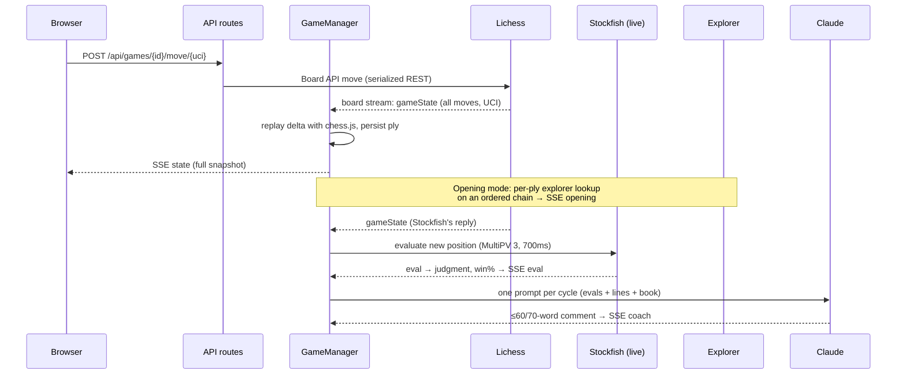

# lichess-coach

A self-hosted chess coach that watches you play **casual games against Stockfish on Lichess** and coaches you live, move by move. Local Stockfish grounds every claim, the Lichess Opening Explorer supplies real theory, and Claude turns both into plain-English coaching — during the game and in a structured post-game review.

Single-user by design: it runs in one Docker container on your machine, stores everything in one SQLite file, and authenticates with **your** Lichess account and **your** Claude subscription.

## What it does

- **Creates and plays AI games in-app.** The app challenges Stockfish (level 1–8, unlimited/rapid/blitz) through the Lichess API and renders its own board — zero-delay move streaming via the Board API, no separate Lichess tab needed.
- **Evaluates every ply locally.** A resident Stockfish instance scores each position (MultiPV 3); moves get win-percentage drops and blunder/mistake/inaccuracy judgments using Lichess's published accuracy model.
- **Coaches between moves.** Once per move cycle (your move + the engine's reply), Claude gets the position, evals, and top engine lines, and answers in ≤60 words. A "Ask coach" button gives an on-demand hint in any mode.
- **Teaches openings.** In Opening study mode, every position is looked up in the Lichess Opening Explorer (masters DB, falling back to the 1800+ Lichess player DB): the app names the opening, marks each move in/out of book, shows the top book replies with win/draw/loss stats and a suggestion arrow on a thumbnail board, and Claude explains the theory. Out of book, the mode degrades gracefully into Auto coaching.
- **Reviews finished games.** A pipeline re-analyzes every move at depth 18, computes accuracy, finds where the game left opening theory, and has Claude write a structured review (summary, opening, key moments, what to practice) with tagged key moments.

### Coaching modes

| Mode | During play | Notes |
|---|---|---|
| **Auto** | Claude comments after each of your move cycles, grounded in Stockfish evals | Default |
| **Opening study** | Book card + thumbnail arrow + theory explanations every ply; becomes Auto once out of book | Explorer-backed (see architecture) |
| **Off** | Quiet | "Ask coach" still works |

Modes are chosen at game creation and switchable live from the board.

## Getting started

**Prerequisites:** Docker Desktop, a Lichess account, and a Claude Pro/Max subscription with [Claude Code](https://claude.com/claude-code) installed on the host (for token generation only).

```bash
git clone <this repo> && cd lichess-coach
cp .env.example .env
```

Fill in `.env`:

1. `SESSION_SECRET` — `openssl rand -hex 32`
2. `CLAUDE_CODE_OAUTH_TOKEN` — run `claude setup-token` on the host and paste the token. **Never set `ANTHROPIC_API_KEY`** — the coach service refuses to start a request if it's present, because it would silently bypass the subscription and bill per-token.

Then:

```bash
docker compose up
```

First start installs node modules inside the container (the Claude Agent SDK ships platform-specific binaries, so host `node_modules` never mix with container ones — they live in a named volume) and runs DB migrations. Open <http://localhost:3000>, click **Log in with Lichess** (OAuth PKCE — no app registration needed; token scopes `challenge:write board:play`), and start a game.

### Environment reference

| Variable | Default | Purpose |
|---|---|---|
| `CLAUDE_CODE_OAUTH_TOKEN` | — | Claude Max/Pro subscription token (Agent SDK) |
| `SESSION_SECRET` | — | iron-session cookie encryption (32+ chars, required) |
| `LICHESS_CLIENT_ID` | `lichess-coach.local` | OAuth PKCE client id (any unique string) |
| `APP_URL` | `http://localhost:3000` | OAuth redirect base |
| `DATABASE_PATH` | `/data/coach.db` | SQLite file (named volume in Docker) |
| `STOCKFISH_PATH` | `/usr/games/stockfish` | Engine binary (Debian package, in the image) |
| `COACH_MODEL` / `REVIEW_MODEL` | `sonnet` | Claude models for live coaching / reviews |
| `EXPLORER_URL` | `https://explorer.lichess.org` | Opening Explorer host (`.ovh` mirror if `.org` doesn't resolve) |

### Development

Everything runs in the container:

```bash
docker compose exec app npm run typecheck   # tsc --noEmit
docker compose exec app npm run lint        # eslint
docker compose exec app npm run db:generate # drizzle migration from schema.ts
docker compose exec app npm run db:studio   # drizzle-kit studio on :4983
```

De-risking spikes (each proves one external contract end-to-end):
`spike:coach` (Agent SDK headless in-container), `spike:stockfish` (UCI wrapper), `spike:stream` (Board API streaming), `spike:explorer` (Opening Explorer auth + response shape). `scripts/dev-session-cookie.ts` prints a sealed session cookie so API routes can be curl-ed during development.

---

# Architecture reference

## System overview

```
┌─────────────────────────── Docker container ───────────────────────────┐
│                                                                        │
│  Next.js 16 (App Router, single process)                               │
│  ┌──────────────┐   SSE    ┌─────────────────────────────────────┐     │
│  │ React client │◄─────────┤ Route handlers (/api/**)            │     │
│  │ (play board, │  fetch   │   └── GameManager registry          │     │
│  │ opening card,│─────────►│        (one EventEmitter per game)  │     │
│  │ review view) │          └──────┬────────┬────────┬────────────┘     │
│  └──────────────┘                 │        │        │                  │
│                            ┌──────▼──┐ ┌───▼────┐ ┌─▼─────────┐        │
│                            │Stockfish│ │ SQLite │ │Claude     │        │
│                            │live+batch│ │ Drizzle│ │Agent SDK  │        │
│                            └─────────┘ └────────┘ └───────────┘        │
└───────────┬──────────────────────────────────────────┬─────────────────┘
            │ Board API stream + REST (serialized)     │ Explorer REST
            ▼                                          ▼   (serialized)
       lichess.org                            explorer.lichess.org
```

- **One process** hosts everything: the Next.js server, per-game managers, two Stockfish child processes, and the SQLite file. There is no job queue or second service.
- **Two upstream hosts, two independent serial queues.** Lichess etiquette is one request at a time with a ≥60s pause after HTTP 429. `createSerialQueue(name)` (`src/lib/lichess/queue.ts`) gives `lichess.org` REST and the explorer their own chains so a 429 on one host never stalls the other. Long-lived streams bypass the queues entirely.
- **Stack:** Next.js 16 / React 19 / TypeScript / Tailwind 4, TanStack Query, `react-chessboard` + `chess.js` on the client; Drizzle + better-sqlite3 (WAL), hand-rolled UCI wrapper, `openapi-fetch` typed by `@lichess-org/types`, iron-session, Claude Agent SDK on the server.

## The move cycle (core data flow)



The invariant behind coaching: **exactly one Claude call per full move cycle**, triggered when the eval of the *latest* ply lands and that ply is the AI's reply. The opening prompt *replaces* the auto prompt in a cycle, never adds to it. Hints (`user_request`) are separate and available in every mode; a newer coach request aborts any in-flight one.

## Server components

### `GameManager` (`src/lib/games/manager.ts`) — the heart

One instance per active game, held in a `globalThis` registry keyed by game id. It is the single writer for a game's state:

- **Stream loop.** Connects to `GET /api/board/game/stream/{id}` (ndjson, zero-delay, `board:play` scope) with a 20s silence watchdog (keepalive blanks arrive ~7s apart) and exponential reconnect. A clean close after a terminal status is the *normal* end-of-game signal; reconnects only happen while a game is live.
- **Canonical replay.** `gameState` frames carry the full UCI move string; the manager replays only the delta through chess.js (handling promotions and king-onto-rook castling notation), persists each ply, and wholesale-emits a fresh snapshot. If the server ever reports *fewer* moves than local state, it resyncs from scratch (deleting per-ply rows, including opening annotations).
- **Eval pipeline.** Every new ply is queued against the `live` engine. Scores arrive side-to-move POV (UCI convention) and are **normalized to White POV before storage** — one convention everywhere downstream. Win% and judgments follow the [Lichess accuracy model](https://lichess.org/page/accuracy) (drop thresholds 10/20/30).
- **Coach triggers.** On the latest-AI-ply eval: `auto` mode → `triggerAutoCoach`; `opening` mode → `triggerOpeningCoach` (below); `off` → nothing.
- **Rehydration.** The constructor rebuilds moves, evals, comments, and opening annotations from SQLite synchronously — never the network — so container restarts and dev-server HMR are invisible to the client.

Boot (`src/lib/boot.ts`, via `instrumentation.ts`) re-attaches managers for games that were live at last shutdown, starts the single global Lichess event stream (one per token — Lichess closes duplicates), and resumes reviews interrupted mid-flight.

### Stockfish (`src/lib/stockfish/`)

A hand-rolled ~150-line UCI wrapper (no maintained npm wrapper exists) with a serialized job queue per engine and crash-respawn. Two resident instances so reviews never starve live play:

| Instance | Settings | Used for |
|---|---|---|
| `live` | MultiPV 3, 700ms/position | per-ply evals + coach prompt lines |
| `batch` | MultiPV 2, depth 18 (≤1s) | post-game review analysis |

Terminal positions (`bestmove (none)`) are first-class: they resolve to checkmate/stalemate win% without engine lines.

### Coach service (`src/lib/coach/`)

`requestCoachText(prompt, { systemPrompt, model, abortController })` wraps the **Claude Agent SDK** in stateless single-turn mode (`maxTurns: 1`, no tools, no settings sources). Auth is the Max-subscription OAuth token — the raw Anthropic Messages API does not accept subscription auth, which is why the Agent SDK is used at all; the service hard-fails if `ANTHROPIC_API_KEY` is set to prevent accidental per-token billing.

Three prompt builders (`prompts.ts`), all sharing one **grounding rule** — every tactical claim must be consistent with the supplied engine data, all evals are White-POV:

- `buildAutoPrompt` — move-cycle commentary (≤60 words), includes judgment, missed best move, top lines, and the last two comments for anti-repetition.
- `buildOpeningPrompt` — opening-mode commentary (≤70 words) under a stricter **BOOK RULE**: Claude may recommend *only* moves from the supplied book list, top book move first, with engine lines provided solely to keep explanations tactically honest.
- `buildHintPrompt` — on-demand hints (≤100 words) that nudge rather than spoil unless the position is tactically forced.

### Opening study subsystem (`src/lib/openings/`)

- **`explorer.ts`** — typed `openapi-fetch` client for the Opening Explorer. The explorer **requires a Lichess OAuth token** (anonymous requests 401 — a policy Lichess adopted after scraping abuse, not an outage); requests reuse the stored user token with a descriptive User-Agent. Caching is two-layer: in-process `Map` → `opening_cache` table (30-day TTL) → network through the dedicated serial queue. Every query sends `fen` = the game's root position **plus** `play` = the full UCI move sequence — that (per the API spec) is what keeps opening names accurate through transpositions and after leaving book. Array params are serialized comma-joined (the explorer's format; `openapi-fetch` would explode them by default). A 401 disables lookups for the cycle without pausing the queue; a 429 pauses the explorer queue 60s.
- **`book.ts`** — pure book policy: query `/masters`; if the position has <20 total games, fall back to `/lichess` filtered to 1800+ blitz/rapid/classical (low-level Stockfish leaves master theory fast). A move is "book" when its game count is ≥3 (masters) / ≥50 (lichess). Top 5 by game count, **never re-ranked by engine eval** — theory is the point of the mode.
- **Manager wiring** — every ply gets one lookup for the position after it, executed on a per-game promise chain so ply *p−1* always resolves before *p* (a move is in book iff it appears in the *previous* position's book list). Each result is persisted to `opening_plies`, emitted as an SSE `opening` event, and mirrored onto the game row's `opening_eco/name`. `leftBookPly` (first non-book ply) is sticky for display; "in book now" is per-position, so transpositions back into theory re-enable opening coaching. Explorer failures store an empty state and the cycle silently falls back to Auto — the explorer being down never blocks coaching.

### Review pipeline (`src/lib/review/`)

An in-process async job guarded by a status machine on the `reviews` row (`pending → analyzing → generating → complete|failed`), idempotent across its two triggers (game finish + the global event stream) and resumed at boot. Steps:

1. Fetch the Lichess post-game export (authoritative PGN + opening name; tolerated failure).
2. Determine the **opening departure**: read `opening_plies`; for games not played in opening mode, backfill plies 0..min(30, n) via the cached explorer path so *every* review knows where the game left book.
3. Re-evaluate every position with the `batch` engine, computing per-move judgments and overall accuracy (Lichess formula).
4. One Claude call writes a fixed-format markdown review (Summary / Opening — referencing the book departure / Key Moments / What to Practice / One Habit) ending in a fenced JSON block of key moments, which is parsed and written back onto moves as motif tags.

### Persistence (`src/lib/db/`)

SQLite (WAL, foreign keys) via Drizzle; migrations generated by `drizzle-kit` and applied by the container entrypoint on every start. One `globalThis` connection survives HMR.

| Table | Contents |
|---|---|
| `credentials` | exactly one row (id=1): Lichess token, user id, scopes |
| `games` | one per game: colors, level, clock, status/result, moves string, PGN, opening, coach mode |
| `moves` | one per ply: SAN/UCI/FEN, clock, White-POV eval, win%, cp loss, judgment, best line, phase, motif tags |
| `coach_comments` | every coach reply: ply, trigger (`auto`\|`user_request`\|`opening`), text, eval snapshot given to Claude, model, latency |
| `opening_cache` | explorer responses keyed `source\|rootFen\|play`, 30-day TTL |
| `opening_plies` | per-ply opening annotation: ECO/name, source, in-book flag, book moves JSON, suggestion |
| `reviews` | status machine + review markdown, key moments JSON, accuracy |

Enums live in TypeScript only (no SQL CHECK constraints), so widening one is a TS-only change.

## API surface

All routes are session-guarded (iron-session cookie, set by the Lichess OAuth PKCE flow under `/api/auth/*`).

| Route | Purpose |
|---|---|
| `POST /api/games` | challenge Stockfish, insert row, attach manager |
| `GET /api/games` | recent games list |
| `GET /api/games/{id}` | snapshot from the DB (works for finished games) |
| `GET /api/games/{id}/events` | **SSE stream** (below) |
| `POST /api/games/{id}/move/{uci}` | play a move (Board API) |
| `POST .../resign`, `POST .../abort` | game controls |
| `POST /api/games/{id}/coach` | on-demand hint |
| `PUT /api/games/{id}/coach` | switch coach mode (`auto`\|`opening`\|`off`) |
| `GET/POST /api/games/{id}/review` | read / (re)generate the review |

**SSE protocol:** on connect the server sends `snapshot` (full `GameSnapshot`), then `state`/`finish` frames (each a *complete* snapshot — the client wholesale-replaces, no diffing) interleaved with `eval`, `coach`, and `opening` deltas, plus `: ping` comments every 15s. EventSource auto-reconnect simply lands on a fresh snapshot, so no resume bookkeeping exists anywhere.

## Client

`useGameEvents(gameId)` owns the single client-side source of truth: the latest `GameSnapshot`, into which `eval`/`coach`/`opening` deltas are merged **by value** (never by index — events may race the state frame for the same ply). Everything else renders from the snapshot:

- `PlayClient` — layout: eval bar (any coaching mode), `Board` (drag/click with legal-move dots and lichess-style castling gestures, optimistic move overlay cleared by the next server frame), clocks, move list, `OpeningCard` (opening mode only), `CoachPanel`.
- `OpeningCard` + `MiniBoard` — the book card: ECO/name + source badge, a 176px non-interactive thumbnail (same `Chessboard` component as the main board, distinct `id`) with a green arrow for the suggestion, top-5 book rows with student-POV W/D/L bars (hover/tap moves the arrow), collapsed one-liner when out of book, dimmed while the newest ply's lookup is pending. The card renders entirely from `OpeningState` (including its own FEN), so it never waits on the main board's state.
- `CoachPanel` — comment feed labeled by trigger (`after` / `hint` / `opening`), three-way mode control, "Ask coach".
- `ReviewView` — polls the review status, renders the constrained review markdown, key-moment chips linking to Lichess analysis, accuracy + opening ("left book at …") chips, annotated move table.

## Cross-cutting conventions

- **White-POV evals everywhere.** UCI side-to-move scores are normalized once, at the manager/pipeline boundary; prompts, storage, and UI all speak White-POV (`+1.20` favors White). Win%-drop/judgment math is mover-POV on top of that.
- **`globalThis` singletons** for anything with a lifetime (DB handle, engines, game-manager registry, queues, caches, event stream) so Next.js dev HMR never duplicates processes or connections.
- **Fair play is structural.** The app only ever creates and manages its own games against the Lichess AI (always casual); unknown game ids are refused. Live coaching in human games would violate Lichess fair-play rules — that boundary is deliberate and load-bearing.
- **Graceful degradation over blocking.** Coach errors are swallowed for automatic triggers (surfaced only for explicit hints); explorer failures degrade opening mode to Auto; export failures leave the locally computed data in place. Nothing on the move path ever awaits the network beyond Lichess itself.
- **Etiquette by construction.** Serialized REST per host, 60s+ backoff on 429, aggressive caching of explorer responses (they're static), streams outside the queues.

## Repository layout

```
src/
  app/                 App Router pages (/, /play/[id], /games/[id]) + /api routes
  components/          Board, OpeningCard, MiniBoard, CoachPanel, ReviewView, …
  hooks/               useGameEvents (SSE→snapshot), useCreateGame
  lib/
    games/             GameManager + client-safe types (GameSnapshot, events)
    lichess/           typed REST client, serial queues, ndjson streams, event stream
    stockfish/         UCI wrapper + live/batch service
    openings/          explorer client + cache, book policy
    coach/             Agent SDK service + prompt builders
    review/            post-game pipeline + review prompt
    db/                Drizzle schema + SQLite connection
api/                   vendored lichess-org/api (read-only reference, gitignored)
drizzle/               generated SQL migrations
scripts/               contract spikes + dev session cookie helper
```
